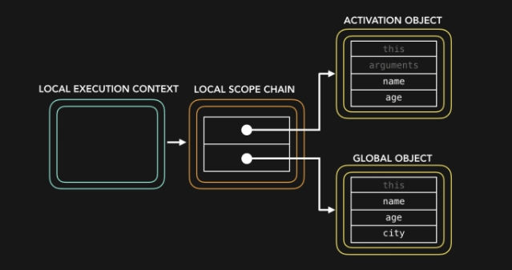
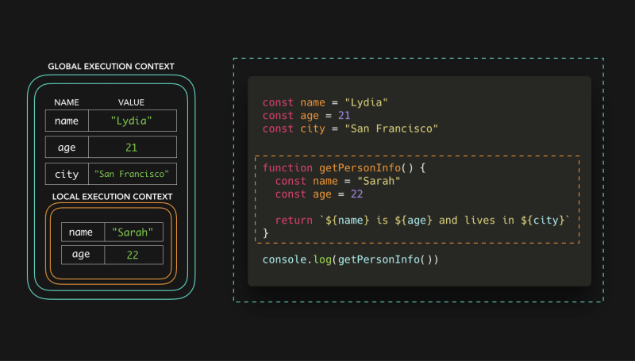
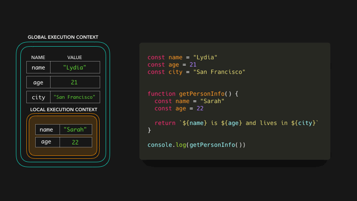

来看看下面的代码：

```javascript
const name = "Lydia"
const age = 21
const city = "San Francisco"

function getPersonInfo() {
  const name = "Sarah"
  const age = 22

  return `${name} is ${age} and lives in ${city}`
}

console.log(getPersonInfo())
```
We're invoking the `getPersonInfo` function, which returns a string containing the values of the `name`, `age` and `city` variables:  
我们正在调用 getPersonInfo 函数，该函数将返回一个包含姓名、年龄和城市变量值的字符串：`Sarah is 22 and lives in San Francisco`.

But, the `getPersonInfo` function doesn't contain a variable named city 🤨? How did it know the value of city?

First, memory space is set up for the different contexts.  
首先，为不同的上下文设置内存空间。  

We have the default global context (`window` in a browser, `global` in Node),   
我们有默认的全局上下文（浏览器中的`window`，Node 中的 `global`上下文），

and a local context for the `getPersonInfo` function which has been invoked.   
以及用于调用 `getPersonInfo` 函数的本地上下文。

Each context also has a scope chain.  
每个上下文还有一个作用域链。

For the `getPersonInfo` function, the scope chain looks something like this :   
对于 `getPersonInfo` 函数，作用域链看起来是这样的：

local execution context -> local scope chain
本地执行上下文 -> 本地作用域链



The scope chain is basically a "chain of references" to objects  
作用域链基本上是对象的 "引用链"，  

that contain references to values (and other scopes) 
that are referencable in that execution context.   
其中包含对该执行上下文中可引用的值（和其他作用域）的引用。

In the following examples,  
在下面的示例中，

the `key/value` pairs in the execution contexts represent the references that the scope chain has to the variables.  
执行上下文中的键/值对表示作用域链对变量的引用。



The scope chain of the global execution context has a reference to 3 variables: name with the value Lydia, age with the value 21, and city with the value San Francisco.   
全局执行上下文的作用域链引用了 3 个变量：姓名（值为 Lydia）、年龄（值为 21）和城市（值为旧金山）。

In the local context, we have a reference to 2 variables: name with the value Sarah, and age with the value 22.  
在本地上下文中，我们引用了 2 个变量：姓名（值为 Sarah）和年龄（值为 22）。

When we try to access the variables in the `getPersonInfo` function, the engine first checks the local scope chain.  
当我们尝试访问 `getPersonInfo` 函数中的变量时，引擎会首先检查本地作用域链。



In the global context,  
在全局上下文中，

we declared the variable city with the value of San Francisco,  
我们声明了值为 San Francisco 的变量 city，

thus has a reference to the variable city.  
因此有了对变量 city 的引用。

Now that we have a value for the variable,  
现在我们有了变量的值，

the function `getPersonInfo` can return the string Sarah is 22 and lives in San Francisco 🎉  
函数 `getPersonInfo` 可以返回字符串 Sarah is 22 and lives in San Francisco 🎉


We can go down the scope chain, but we can't go up the scope chain.  
我们可以向下移动作用域链，但不能向上移动作用域链。


[JavaScript Visualized: Scope (Chain)](https://dev.to/lydiahallie/javascript-visualized-scope-chain-13pd)