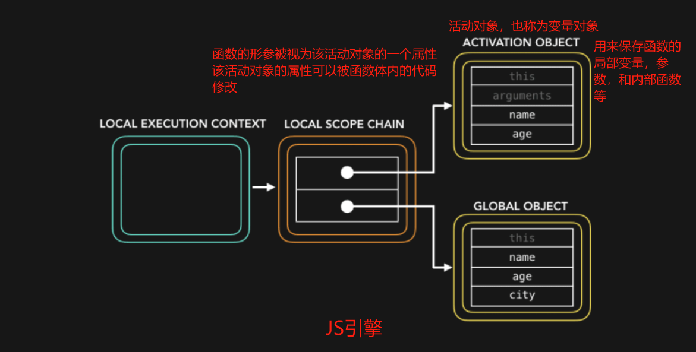

## 函数的形参在函数体内可以被重新赋值吗？

在JavaScript中，<span class="bg-yellow-200">函数的形参在函数体内可以被重新赋值</span>，但重新赋值只会影响函数体内的局部变量，不会影响传递给函数的实际参数值。

这是因为在函数被调用时，JavaScript引擎会创建一个活动对象（activation object，也称为变量对象），用来保存函数的局部变量、参数和内部函数等信息。函数的形参被视为该活动对象的一个属性，可以被函数体内的代码修改。


举个例子：

```javascript
function add(a, b) {
    a = a + 1;  // 对形参a重新赋值
    console.log(a);  // 输出：6
    console.log(b);  // 输出：2
}

add(5, 2);
```
在上面的例子中，虽然在函数体内对形参 a 进行了重新赋值，但这个赋值操作只在函数体内有效。
当函数被调用时，实际参数 5 和 2 会被复制到形参 a 和 b 中的活动对象中，
形参 a 的重新赋值只是改变了该活动对象中的 a 值，并不会影响函数外部调用时传递的实际参数 5。

总结来说，JavaScript中函数的形参可以在函数体内被重新赋值，这是因为<span class="bg-yellow-200">形参实际上是函数局部作用域中的变量，与普通变量一样可以被修改。</span>


