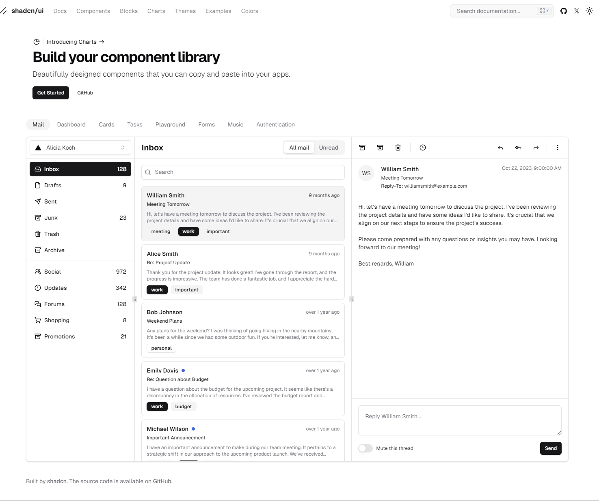

## UI 设计颜色参考

[Tailwind CSS Color Generator](https://uicolors.app/create) 创建自定义色阶

## UI 组件&库

### shadcn
[shadcn](https://ui.shadcn.com/) 不是一个组件库。 它是一个用于 React 可重复使用的组件集合(另一个Vue版本的是 [shadcn-vue](https://www.shadcn-vue.com/))，您可以将其复制并粘贴到您的应用程序中。

你不能将其作为依赖项来安装。 你可以选择需要的组件。 将代码复制并粘贴到你的项目中，然后根据你的需要进行定制。 代码归您所有，请将其作为构建自己的组件库的参考。

