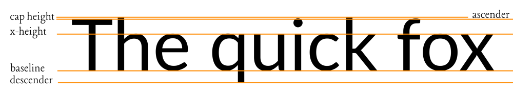
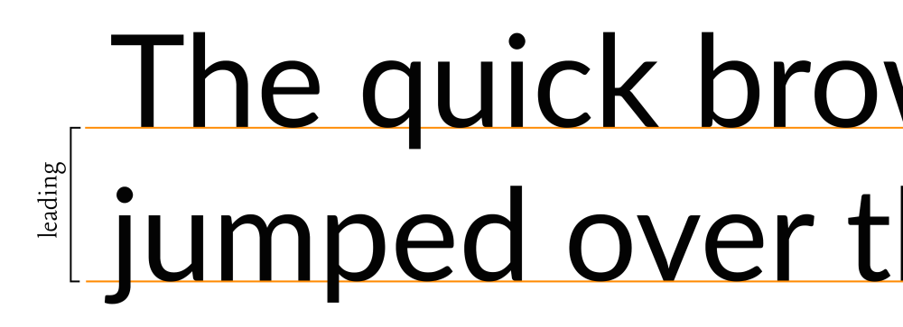
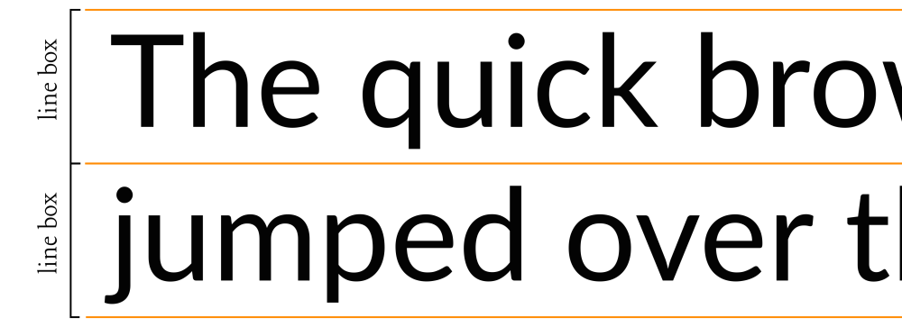

## 简介
[line-height](https://developer.mozilla.org/zh-CN/docs/Web/CSS/line-height) 设置行框的高度。
- 通常用于设置文本行之间的距离，如多行文本的间距
- 在块级元素中，它指定元素内行框的最小高度
- 对于非替代的 inline 元素，它用于计算行盒（line box）的高度

### 参考文章
- [如何在 CSS 中控制行高](https://css-tricks.com/how-to-tame-line-height-in-css/)
- [深入探究 CSS：字体规格、行高和垂直对齐](https://iamvdo.me/en/blog/css-font-metrics-line-height-and-vertical-align)

在传统的西方字体设计中，一行文字由几个部分组成：
- `Baseline`【基线】: 这是字体所在的假想线。当您在横格笔记本中书写时，基线就是您书写的线。
- `Descender`【下降线】: 这条线位于基线正下方。这是一些字符（如小写字母g、j、q和y）与基线接触的线。
- `X-height`【X 高度】: 这是一行文本中普通小写字母的高度。通常，这是其他小写字母的高度，尽管有些小写字母的某些部分可能会超出 x 高度。无论出于何种目的，它都是小写字母的感知高度。
- `Cap-height`【大写字母高度】: 这是给定文本行上大多数大写字母的高度。
- `Ascender`【上升部】: 通常出现在大写字母高度正上方的一条线，某些字符（如小写字母h或b可能超过正常大写字母的高度）。



上述文本的每个部分都是字体本身所固有的。字体的设计考虑了这些部分；但是，排版的某些部分由排版员（比如你和我！）而不是设计师决定。其中之一就是行距。

行距定义为一组类型中两个基线之间的距离。



当浏览器遇到 `line-height` 属性时，
<span class="bg-yellow-200">它实际上会将文本行放在“行框”中，“行框”的高度与元素的行高相匹配。
我们不会在字体上设置行距，而是得到类似于在行框的两侧填充的内容。</span>



如上图所示，行框环绕一行文本，行距是利用一行文本下方和下一行文本上方的空间来创建的。这意味着，对于页面上的每个文本元素，在特定文本块中，行距的一半位于第一行文本上方和最后一行文本之后。

更令人惊讶的是，在元素上明确设置`line-height`和`font-size`具有相同值会在文本上方和下方留下额外空间。我们可以通过为元素添加背景颜色来看到这一点。


这是因为，尽管`font-size`设置为 32px，但由于产生了间距，实际文本大小仍会小于该值。


--------------------------

当一个`<p>`元素在屏幕上呈现时，它可以由多行组成，具体取决于其宽度。
每行由一个或多个内联元素（HTML 标签或用于文本内容的匿名内联元素）组成，称为 **线框**。
**线框的高度基于其子元素的高度。**
因此，浏览器会计算每个内联元素的高度，从而计算线框的高度（从其子元素的最高点到其子元素的最低点）。
因此，线框始终足够高以包含其所有子元素（默认情况下）。

每个 HTML 元素其实都是一堆 `line-box` 的堆叠。如果你知道每个`line-box`的高度，你就知道元素的高度。

```html
<p>
    Good design will be better.
    <span class="a">Ba</span>
    <span class="b">Ba</span>
    <span class="c">Ba</span>
    We get to make a consequence.
</p>
```
它将生成3个行框：


（黑色边框）`<p>`由包含内联元素（实线边框）和匿名内联元素（虚线边框）的线框（白色边框）组成。

我们清楚的看到第二个行框比其他行框高，这是由于其子行框的内容区域计算所致

**线框创建过程中的困难部分在于我们无法真正看到它，也无法用 CSS 控制它。**

即使应用背景也无法给我们提供关于第一个线框高度的任何视觉线索。

到目前为止，我介绍了两个概念：`content-area` 和 `line-box`。

我说过`line-box`的高度是根据其子元素的高度计算的，但我并没有说其子元素`content-area`的高度。这有很大的不同。

尽管听起来很奇怪，但**内联元素有两个不同的高度：内容区域高度和虚拟区域高度**（我发明了虚拟区域这个术语，因为高度对我们来说是不可见的，但你不会在规范中找到任何出现）。
