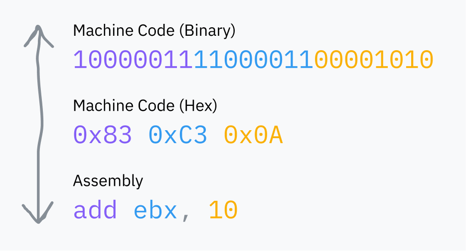
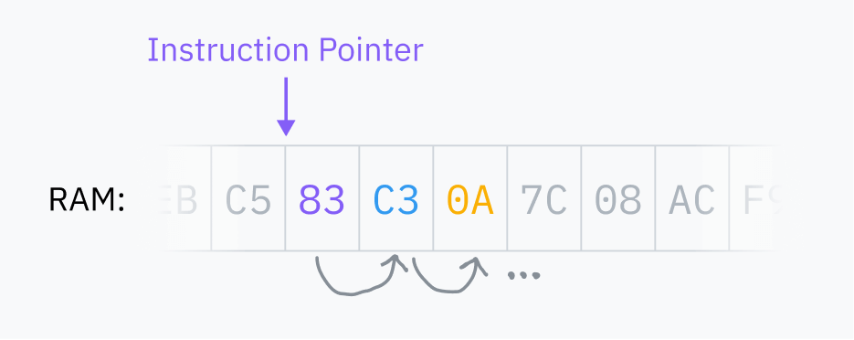

https://geekdaxue.co/read/Putting-the-you-in-cpu/the-basic

## 基础

CPU执行的“指令”只是二进制数据。

CPU 始终直接从 RAM 读取机器代码，代码如果没有加载到 RAM 中是不能运行的。

CPU 存储了一个 **指令指针**，它指向 CPU 将要从 RAM 中获取下一条指令的位置。每执行一条指令后，CPU 移动指针并重复。这就是**取指执行周期**。

执行一条指令后，指针会向前移动到 RAM 中指令后面的地方，这样它现在就指向下一条指令。这就是代码运行的原因！

指令指针不断向前移动，以存储在内存中的顺序执行机器代码。有些指令可以告诉指令指针跳到其他地方，或者根据某个条件跳到不同的地方；这使得可重用代码和条件逻辑成为可能。

指令指针存储在一个寄存器中。

一些寄存器可以直接从机器代码中访问，比如 `ebx`。

其他寄存器仅供 CPU 内部使用，但通常可以使用专用指令进行更新或读取。例如指令指针，它不能直接读取，但可以通过跳转指令等进行更新。

某个文件中有机器代码。操作系统将其加载到 RAM 中，并指示 CPU 将指令指针跳到 RAM 中的那个位置。CPU 像往常一样继续运行它的取指执行周期，于是程序就开始执行了！

CPU 的世界观非常基础；它们只能看到当前的指令指针和一些内部状态。进程完全是操作系统的抽象概念，而不是 CPU 本身理解或跟踪的东西。

### 内核是什么？

内核是操作系统的核心。

当你启动计算机时，指令指针从某个程序开始。那个程序就是内核。内核几乎可以完全访问你的计算机内存、外围设备和其他资源，并负责运行安装在你计算机上的软件（称为用户态程序）。

- Linux 只是一个内核，需要很多用户态软件，如 shell 和显示服务器，才能使用。
- macOS 的内核称为 XNU，类似于 Unix，
- 而现代 Windows 的内核称为 NT Kernel。

### 处理器的模式

处理器的模式（又称为特权级别或环 CPL）控制它允许做什么。现代架构至少有两个选项：内核/监督模式和用户模式。虽然架构可能支持多于两种模式，但目前只常用内核模式和用户模式。

- 在内核模式中，一切都可以：CPU 被允许执行任何支持的指令并访问任何内存。
- 在用户模式中，只允许执行一部分指令，I/O 和内存访问受到限制，许多 CPU 设置被锁定。

通常情况下，内核和驱动程序在内核模式下运行，而应用程序在用户模式下运行。

处理器以内核模式启动。在执行程序之前，内核会启动切换到用户模式的过程。

在 x86-64 架构中，可以从名为 `cs`（代码段）的寄存器中读取当前特权级（CPL）。具体来说，CPL 包含在 `cs` 寄存器的两个最低有效位中。这两个位可以存储 x86-64 的四个可能的环：
- 环 0 是内核模式，
- 环 3 是用户模式。
- 环 1 和环 2 设计用于运行驱动程序，但仅由少数旧的特殊操作系统使用。

如果 CPL 位是 11，CPU 正在运行在环 3：用户模式。

