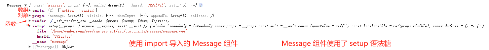
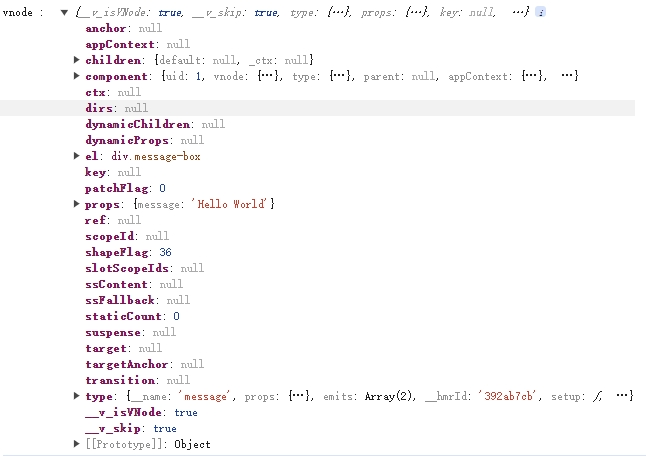
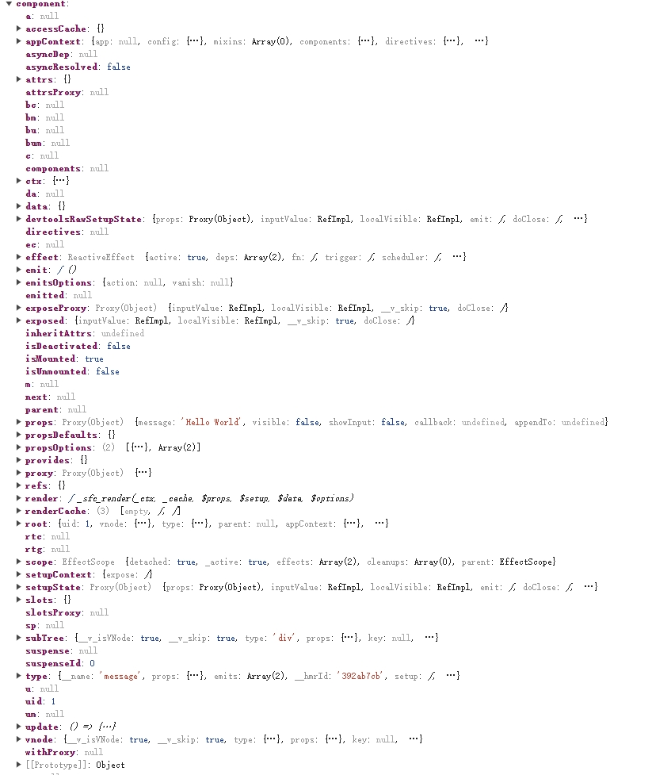
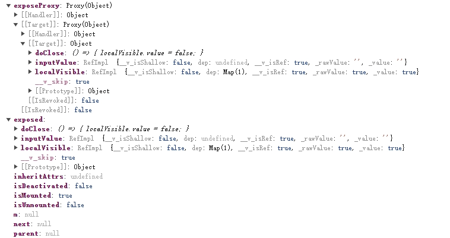
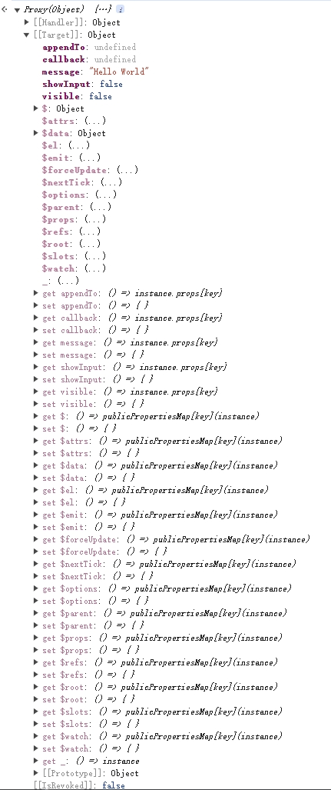

**导入一个组件**



**使用组件创建一个 vnode**

```javascript
const vnode = createVNode(Message, props, {default:null});
render(vnode, container);
appendToElement.appendChild(container.firstElementChild);
```



[vnode.component](vnode.component.md)



**vnode.component.exposed**




[vnode.component.proxy](vnode.component.proxy.md)

